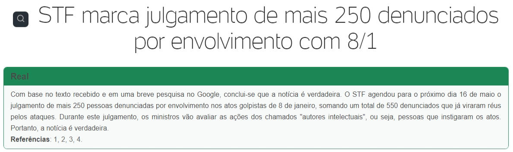
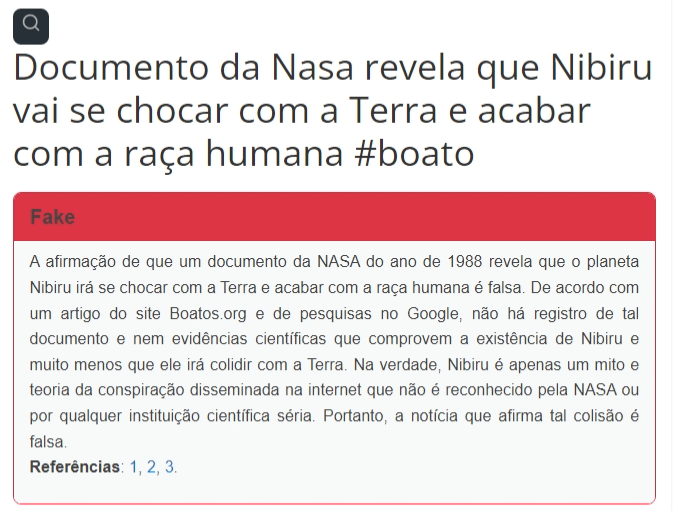

# FakeNo

FakeNo é uma extensão de Google Chrome que auxilia no combate a fake news, utilizando-se
de inteligência artificial para classificar as notícias e da API do GPT para gerar um parágrafo
com uma conclusão sobre a veracidade da notícia.

## Como funciona?

### Na extensão

1. A extensão vai detectar se a página que o usuário está é um artigo de notícias ou não
(isso é feito para aumentar as chances do web scrapper funcionar corretamente na página).
2. Se a página for um artigo de notícias, o script e css necessários para a extensão funcionar
são inseridos na página.
3. Um botão é adicionado ao lado do título da notícia.
4. Ao clicar o botão uma chamada para rota `/fakenews/analyse` da API é feita, 
passando a url da página no corpo da requisição.

### Na API

1. Com a lib _newspaper3k_ a notícia da url recebida é buscada e resumida.
2. Usando a API do GTP uma query de busca sobre o assunto é criada.
3. Usando a _custom search api_ do Google a pesquisa é feita, limitando-se aos 3 
primeiros resultados e utilizando-se novamente da lib _newspaper3k_ para extrair
e resumir o conteúdo das páginas.
4. Os resultados são formatados para que possam ser usados posteriormente no GPT.
5. A FakeNo-AI é utilizada para prever se notícia é verdadeira ou falsa.
6. Um text com os resultados do passo 1, 4 e 5 é montado.
7. Esse texto é enviado ao GPT que, com base na instrução dada e do texto recebido, 
gera um parágrafo em realação a veracidade na notícia, incluindo ainda as referências 
utilizadas para chegar a essa conclusão.

## Exemplos

1. Notícia REAL:

2. Notícia FALSA:


## Como utilizar?

1. Clone esse projeto:

```bash
  git clone https://github.com/DanielSLucas/FakeNo
```

2. Instale a extensão no Google Chrome:
    1. Acesse `chrome://extensions/`
    2. Ative o modo de desenvolvedo.
    3. Clique no botão `Carregar sem compactação` e selecione a pasta `extension`

3. Acesse a pasta da API pelo terminal:

```bash
  cd api
```

4. Renomeie aquivo `.env.template` para `.env` e prencha as variáveis ambiente
com suas chaves de acesso.

5. Instale as dependências:

```bash
  pip install -r requirements.txt
```

6. Inicie a API:

```bash
  python run.py
```

7. Acesse uma página de uma notícia, espere o botão com um icone de uma lupa
aparecer ao lado do título e clique nele! 
*Caso queira acompanhar o processo da extensão mantenha o mouse em cima do botão 
para ver o progresso do processo de analise da notícia.

## Processo de desenvolvimento e referências

Caso queira saber mais detalhadamente como foi o processo de desenvolvimento, como 
tudo funciona e as referências utilizadas para desenevolver esse projeto acesse o
[relatório técnico](./relatorio_tecnico.pdf).